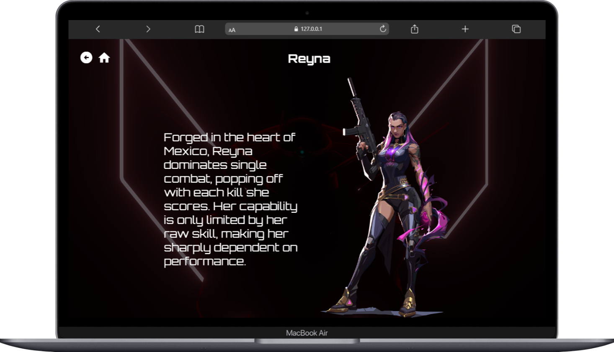

# Valorant - consumindo API

Projeto Frontend consumindo a Valorant-API para exibir informações do jogo. Conta com um carrossel interativo de seleção de personagens e mapas.  

Projeto: https://marcelo23vds.github.io/consumo-valorant-api/  
API Utilizada: https://valorant-api.com/  

## Tecnologias
* HTML
* CSS
* JavaScript
* Valorant-API

## Autor
[Marcelo Vieira](<https://www.linkedin.com/in/marcelovieirasilva/>)
